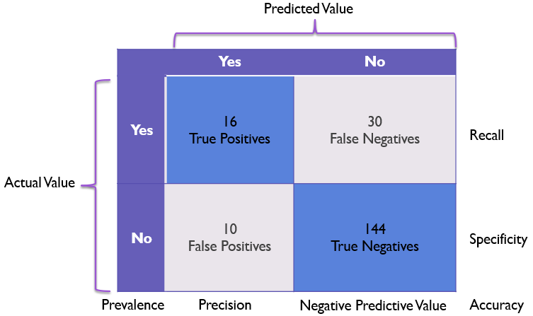

# K-means Clustering

# I. Introduction
- Đây là thuật toán cơ bản nhất của Unsupervised Learning.
- Không biết nhãn (label) của dữ liệu $\to$ nhóm các điểm dữ liệu **có cùng tính chất** vào cùng một phân cụm.

- K-means là một thuật toán với mục tiêu chia tập dữ liệu gồm **$n$ điểm dữ liệu** thành **$k$ cụm** (clusters):
	- Mỗi cụm được biểu diễn (đại diện) bởi một **tâm cụm** (centroid).
	- **Mục tiêu**:
  	  - Tối thiểu hóa phương sai trong cụm (intra-cluster variance);
  	  - Tức là làm giảm sự khác biệt giữa các điểm dữ liệu trong cùng một cụm.

- Phân cụm K-means là một bài toán tối ưu hóa được xếp vào loại **NP-hard**. Để giải bài toán này một cách hiệu quả hơn, thuật toán K-means thường sử dụng các phương pháp **heuristic**, chẳng hạn như khởi tạo tâm cụm thông minh (k-means++).

# II. Phân tích toán học
- Giả sử ta có:
	- Tập $N$ điểm dữ liệu: $X=[x_1, x_2, \dots , x_N] \in \mathbb{R}^{d \times N}$;
	- $K < N$ là số cluster muốn phân chia.
- Cần tìm các tâm cụm (centroid) $m_1, m_2, \dots , m_K \in \mathbb{R}^{d\times 1}$ và nhãn (label) của mỗi điểm dữ liệu.
- Với mỗi điểm dữ liệu $x_i$ ta xác định vector nhãn $y_i = [y_{i1}, y_{i2}, ..., y_{ik}]$ và nếu $x_i$ có nhãn $j$ thì $y_{ij} = 1$ và còn lại là $0$ (biểu diễn one-hot vector). Ta có thể viết ràng buộc như sau:
  $$y_{ik} \in \{0, 1\}; \hspace{4pt} \sum_{i=1}^{K}{y_{ik}} = 1$$

## Khái niệm cơ bản trong K-means
1. Cụm (Cluster):
	- Tập hợp con của bộ dữ liệu mà trong đó các điểm dữ liệu (data points) có sự tương đồng cao hơn so với các điểm dữ liệu thuộc các cụm khác.
2. Tâm cụm (Centroid):
	- Là giá trị trung bình của tất cả các điểm dữ liệu trong cụm - vị trí trung tâm của cụm.
3. Hàm mất mát/mục tiêu (Objective Function):
	- K-means: tối thiểu hóa hàm mất mát, biểu diễn tổng bình phương khoảng cách từ mỗi điểm dữ liệu tới tâm cụm.
4. Khoảng cách Euclidean (Euclidean Distance):
	- Là thước đo phổ biến nhất trong K-means;
	- Được sử dụng để tính khoảng cách giữa hai điểm trong không gian.

# III. Hàm mất mát và thuật toán tối ưu
## 1. Xác định hàm mất mát
- Nếu ta coi $m_k$ là tâm cụm/đại diện (representative) của mỗi cluster:
	- **Ước lượng** tất cả các điểm được phân vào cluster này bởi $m_k$;
	- Điểm dữ liệu $x_i \in$ cluster $k$ $\to$ sai số là $(x_i−m_k)$.
		- Mong muốn sai số này có trị tuyệt đối nhỏ nhất nên ta sẽ tìm cách để đại lượng sau đây đạt GTNN:
          $$\lVert x_i - m_k\lVert_2^2$$
		
		- Vì $x_i \in$ cluster $k$ nên trong vector nhãn one-hot có giá trị $y_{ik} = 1$ nên ta có thể viết biểu thức trên lại thành:
		  $$\sum_{j=1}^{K}{y_{ij} \lVert x_i - m_j \lVert_2^2}$$
		
	- Khi đó, **sai số cho toàn bộ tập dữ liệu** tương ứng là:
	  $$\mathcal{L}(Y, M) = \sum_{i=1}^{N} \sum_{j=1}^{K} y_{ij}\lVert x_i - m_j \lVert_2^2$$
	  thỏa $y_{ij}\in\{0, 1\}$ và $\displaystyle\sum_{j=1}^{K}{y_{ij} = 1}$.

## 2. Tối ưu hàm mất mát
- Bài toán trên là một bài toán khó tìm **điểm tối ưu** vì nó có thêm các điều kiện ràng buộc.
	- Thuộc loại mix-integer programming (điều kiện biến là số nguyên) - rất khó tìm nghiệm tối ưu toàn cục (global optimal point), tức là nghiệm làm cho hàm mất mát đạt giá trị nhỏ nhất có thể.
	- Tuy nhiên, trong một số trường hợp: vẫn có thể tìm được nghiệm gần đúng hoặc điểm cực tiểu.
- Một cách đơn giản để giải bài toán là **xen kẽ giải** $Y$ & $M$ khi biến còn lại được cố định.
- Đây là một thuật toán lặp, cũng là kỹ thuật phổ biến khi giải bài toán tối ưu.

### 2.1 Cố định $M$, tìm $Y$
- **Cố định centers - tìm label vector tối ưu.**
- Bài chia nhỏ thành tìm label vector cho từng điểm dữ liệu $x_i$ như sau:
  $$y_i = \arg\min_{y_i} \sum_{j=1}^{K} y_{ij}\lVert x_i - m_j \lVert_2^2$$
  với điều kiện đã nêu.
- Như đã nói, đây là one-hot vector nên chỉ có duy nhất một giá trị bằng 1 trong vector $y_i$, do đó ta có:
  $$j = \arg\min_j \lVert x_i - m_j \lVert_2^2$$

- Vì $\lVert x_i - m_j \lVert_2^2$ là bình phương khoảng cách 2 điểm trong không gian $\to$ **mỗi điểm $x_i$ thuộc cluster có center gần nhất**.

### 2.2 Cố định $Y$, tìm $M$
- **Cố định cluster, tìm center mới.**
- Bài toán trở thành (tổng các khoảng cách min):
  $$m_j = \arg\min_{m_j} \sum_{i=1}^{N} y_{ij} \lVert x_i - m_j \lVert_2^2$$
- Tới đây, ta có thể tìm nghiệm bằng phương pháp giải đạo hàm bằng $0$, vì hàm cần tối ưu là một hàm liên tục và có đạo hàm xác định tại mọi điểm.
- Và quan trọng hơn, hàm này là hàm convex (lồi) theo $m_j$ nên chúng ta sẽ tìm được GTNN và điểm tối ưu tương ứng.
- Nói đơn giản, $m_j$ **là trung bình cộng của các điểm trong cluster** $j$.

# IV. Thuật toán K-means
Từ đó, ta xác định thuật toán K-means bao gồm các bước như sau:
1. **Khởi tạo tâm cụm ban đầu:**
    - Lựa chọn ngẫu nhiên kk tâm cụm ban đầu từ tập dữ liệu.
    - Có thể sử dụng phương pháp **k-means++** để chọn tâm cụm ban đầu sao cho khoảng cách giữa các tâm được tối ưu, giúp thuật toán hội tụ nhanh hơn.
2. **Gán cụm cho các điểm dữ liệu:**
    - Mỗi điểm dữ liệu $x_j$ được gán vào cụm $C_i$ sao cho khoảng cách từ $x_j$ đến tâm cụm $\mu_i$ là nhỏ nhất: $$C_i = \{x_j : ||x_j - \mu_i||^2 \leq ||x_j - \mu_l||^2, \forall l \neq i\}$$
3. **Tính lại tâm cụm:**
    - Tâm cụm $\mu_i$ được cập nhật bằng trung bình cộng của các điểm dữ liệu trong cụm:i$$\mu_i = \frac{1}{|C_i|} \sum_{x \in C_i} x$$
4. **Lặp lại:**
    - Quay lại bước 2 và lặp lại quá trình cho đến khi hội tụ. Tiêu chí hội tụ bao gồm:
        - Tâm cụm không còn thay đổi đáng kể qua các vòng lặp.
        - Giá trị của hàm mất mát không thay đổi hoặc thay đổi rất ít qua các vòng lặp.

# V. Silhouette Score
## 1. Mục đích
- Silhouette Score là một độ đo dùng để *đánh giá chất lượng phân cụm*.
- Giá trị của Silhouette Score nằm trong khoảng $[-1, 1]$:
    - $\hspace{8pt}1$  : gán đúng vào cụm, cụm phân tách rõ ràng.
    - $\hspace{8pt}0$  : điểm dữ liệu nằm ở biên giữa hai cụm.
    - $-1$ : điểm dữ liệu có khả năng bị gán sai cụm.

## 2. Công thức
- Silhouette Score cho một điểm dữ liệu $i$ được tính như sau:
  $$s(i) = \frac{b(i) - a(i)}{\max(a(i), b(i))}$$
  trong đó:
	- $a(i)$: Khoảng cách trung bình từ điểm $i$ tới các điểm khác trong cùng cụm:
      $$a(i) = \frac{1}{|C_a| - 1} \sum_{j \in C_a, j \neq i} d(i, j)$$
	  với $C_a$ là cụm mà điểm $i$ thuộc về.
	- $b(i)$: Khoảng cách trung bình từ điểm $i$ tới các điểm trong cụm gần nhất mà $i$ không thuộc về:
	  $$b(i) = \min_{C_b \neq C_a} \frac{1}{|C_b|} \sum_{j \in C_b} d(i, j)$$

# VI. Nhận xét và Ứng dụng
## 1. Nhận xét
- **Hội tụ**:
	- K-means luôn hội tụ sau một số vòng lặp hữu hạn, vì hàm mất mát luôn giảm hoặc giữ nguyên qua mỗi lần lặp.  
	- Tuy nhiên, có thể hội tụ tại **cực trị địa phương** (local optimum) thay vì nghiệm tối ưu toàn cục (global optimum).
- **Khởi tạo tâm cụm**:  
	- Việc khởi tạo tâm cụm ban đầu có ảnh hưởng lớn đến chất lượng phân cụm.
	- Phương pháp *k-means++* cải thiện chất lượng và giảm thiểu khả năng hội tụ sai.

## 2. Cài đặt và Ứng dụng
1. **Chọn số cụm tối ưu**:
	- Sử dụng Silhouette Score để xác định giá trị $k$ (số cụm) tối ưu:
	    - Thực hiện K-means với từng giá trị $k$ từ 2 đến 20.
	    - Tính Silhouette Score cho từng $k$.
	    - Chọn $k$ sao cho Silhouette Score đạt giá trị cao nhất.
2. **Huấn luyện K-means**:
	- Sử dụng thư viện `sklearn.cluster.KMeans` để triển khai thuật toán.
	- Cài đặt tham số như sau:
	    - `n_clusters`: Số cụm tối ưu $k$.
	    - `random_state`: Giá trị cố định để đảm bảo kết quả tái lập.
	    - `n_init`: Số lần chạy thuật toán với các khởi tạo tâm cụm khác nhau (thường đặt là 10).
	    - `init`: Phương pháp khởi tạo tâm cụm, sử dụng **k-means++**.
3. **Phát hiện bất thường**:
	- Tính khoảng cách từ từng điểm dữ liệu tới tâm cụm gần nhất.
	- Đặt **ngưỡng (threshold)** dựa trên phân vị thứ 90 ($90\%$) của các khoảng cách này.
	- Gán nhãn:
		- $d > \text{threshold}$: bất thường - anomalies.
		- $d \le \text{threshold}$: bình thường - normal.
4. **Đánh giá**:
	- *Silhouette Score thấp* có thể chỉ ra:
	    - Cụm không được phân tách rõ ràng.
	    - Các cụm chồng lấn hoặc không đồng nhất.
	- Mô hình khó phát hiện các điểm bất thường do:
	    - Lớp bình thường (Normal) chiếm ưu thế lớn, gây mất cân bằng dữ liệu.
	- Precision và Recall thấp dẫn đến F1-score kém.

## 3. Confusion matrix

	

- **Accuracy**: khả năng dự đoán của mô hình.
	- $\text{Accuracy} = \dfrac{\text{TP} + \text{TN}}{\text{TP} + \text{FP} + \text{TN} + \text{FN}}$
- **Recall**: khả năng mô hình nhận ra các giá trị Positives (Actual Yes) ~ Sensitivity.
	- $\text{Recall} = \dfrac{\text{TP}}{\text{TP} + \text{FN}}$
- **Precision**: độ tin cậy của kết quả Positive của mô hình.
	- $\text{Precision} = \dfrac{\text{TP}}{\text{TP} + \text{FP}}$
- **Specificity**: tính đặc hiệu, ngược lại với Recall.
	- $\text{Specificity} = \dfrac{\text{TN}}{\text{FP} + \text{TN}}$
- **Negative Predictive Value (NPV)**: ngược lại với Precision
	- $\text{NPV} = \dfrac{\text{TN}}{\text{TN} + \text{FN}}$
- **Prevalence**: mức độ phổ biến, tập trung vào sự mất cân bằng lớp.
	- $\text{Prevalence} = \dfrac{\text{Actual Yes}}{\text{Actual No}}$

# Tham khảo
- https://machinelearningcoban.com/2017/01/01/kmeans/
- https://accessibleai.dev/post/interpreting_confusion_matrixes/