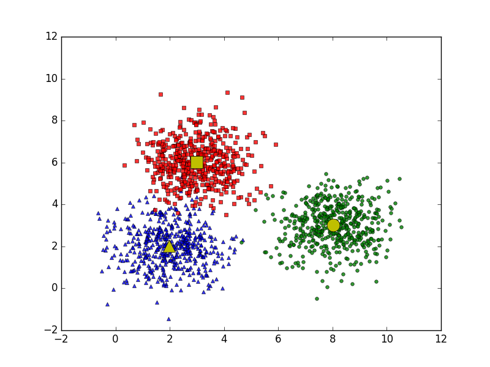
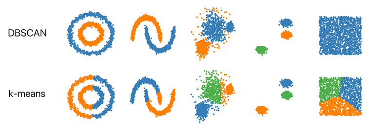

# I. Introduction
- Đối với thuật toán *k-Means* : khởi tạo ngẫu nhiên các centroids $\to$ cập nhật cụm bằng cách cập nhật lại centroids.



- Thuật toán phân cụm phân cấp (Hierarchical Clustering):
	- Thực hiện liên tiếp truy hồi quá trình gộp hoặc chia cụm.
	- Yoàn bộ quá trình này có thể biểu diễn thông qua một biểu đồ *dendogram* và dựa trên biểu đồ đó ta có thể xác định số lượng cụm phù hợp.
- **Nhược điểm**:
	- k-Means:
    	- Phải xác định trước số cụm;
    	- Tâm cụm sẽ bị ảnh hưởng bởi các điểm khởi tạo.
	- Hierachical Clustering:
    	- Chi phí tính toán lớn $O(N^3)$ (với $N$ là số lượng mẫu dữ liệu), không phù hợp với dữ liệu lớn.
## 1. So sánh K-means và DBSCAN

|                   | K-means          | DBSCAN                          |
| ----------------- | ---------------- | ------------------------------- |
| **Nguyên lý**     | Dựa trên tâm cụm | Dựa trên mật độ (density-based) |
| **Ưu điểm**       | Dễ hiểu, triển khai.   | - Khả năng phát hiện các cụm có hình dạng bất kỳ;</br>- Loại bỏ điểm nhiễu hiệu quả;</br>- Không cần xác định trước số lượng cụm. |
| **Nhược điểm**    | - Nhạy cảm với điểm ngoại lai (outliers);</br>- Yêu cầu xác định trước số lượng cụm;</br>- Không phù hợp với dữ liệu có mật độ không đồng đều. | - Độ phức tạp tính toán có thể cao hơn k-Means;</br>- Cần tinh chỉnh hai tham số eps và minPts.        |
| **Xử lý nhiễu**   | - Ảnh hưởng tâm cụm $\to$ chất lượng phân cụm.       | - Phân loại riêng, không ảnh hưởng quá trình hình thành.  |
| **Hình dạng cụm** | - Phù hợp với các cụm có hình dạng gần tròn.| - Có thể phát hiện các cụm có hình dạng bất kỳ, bao gồm cả các cụm có hình dạng lõm hoặc chồng chéo.   |
| **Số lượng cụm**  | Cần xác định trước.       | Tự động, dựa trên mật độ dữ liệu.       |
| **Tham số**       | Số lượng cụm $k$.| Bán kính $eps$ và số điểm tối thiểu trong bán kính $\min Pts$.     |
| **Ứng dụng**      | Dữ liệu đơn giản, phân phối gần tròn.       | Phức tạp, dữ liệu có hình dạng bất kì và nhiều nhiễu.     |



- **Chú ý**
	- Hai tham số củacủa DBSCAN rất quan trọng, việc lựa chọn có thể ảnh hưởng đến kết quả phân cụm.
	- DBSCAN có độ phức tạp cao hơn, đặc biệt với dữ liệu phức tạp. Cần tối ưu hóa và có cấu trúc dữ liệu phù hợp.

## 2. DBSCAN
- DBSCAN (Density-Based Spatial Clustering of Applications with Noise), là thuật toán phân cụm dựa trên mật độ không gian với các dạng dữ liệu có *nhiễu*.
- Khi biểu diễn các điểm dữ liệu trong không gian chúng ta sẽ thấy rằng thông thường các *vùng không gian có mật độ cao sẽ xen kẽ bởi các vùng không gian có mật độ thấp*.
	- Nếu như phải dựa vào mật độ để phân chia thì khả năng rất cao những tâm cụm sẽ tập trung vào những vùng không gian có mật độ cao trong khi biên sẽ rơi vào những vùng không gian có mật độ thấp.
	- Trong lớp các mô hình phân cụm của học không giám sát tồn tại một kĩ thuật _phân cụm dựa trên mật độ_ (Density-Based Clustering),
- **Ý tưởng**: một cụm trong không gian dữ liệu là một vùng có mật độ điểm cao được *ngăn cách với các cụm khác bằng các vùng liền kề có mật độ điểm thấp*.
- DBSCAN là một thuật toán cơ sở để phân nhóm dựa trên mật độ.
	- Nó có thể phát hiện ra các cụm có hình dạng và kích thước khác nhau từ một lượng lớn dữ liệu chứa nhiễu.
# II. DBSCAN
## 1. Concepts
### 1.1 Eps-neighborhood
- **Vùng lân cận Epsilon** của một điểm dữ liệu $P$ được định nghĩa là *tập tất cả các điểm nằm trong phạm vi bán kính $\varepsilon$* (epsilon). $$N_{eps}(P)=\{ Q \in \mathcal{D} : d(P,Q) \le \varepsilon \}$$
### 1.2 Directly Density-Reachable
- **Khả năng tiếp cận trực tiếp mật độ** là việc một điểm có thể tiếp cận trực tiếp tới một điểm dữ liệu khác.
- Cụ thể là một điểm $Q$ được coi là *có thể tiếp cận trực tiếp bởi* điểm $P$ tương ứng với *tham số* $\varepsilon$ và $\text{minPts}$ nếu như nó thoả mãn hai điều kiện:
	1. $Q \in N_{eps}(P)$
		- $Q$ nằm trong vùng lân cận của $P$.
	2. $\vert N_{eps}(Q) \vert \ge \text{minPts}$
		- Số điểm trong vùng lận cận $Q$ tối thiểu là $\text{minPts} \to$ không phải điểm ngoại biên (vùng mật độ thấp).
- Vậy một điểm *có thể tiếp cận* một điểm khác dựa vào:
	- Khoảng cách giữa các điểm;
	- Mật độ các điểm trung vùng lân cận epsilon phải tối thiểu bằng $\text{minPts} \to$ Vùng lân cận có mật độ cao $\to$ Phân vào cụm.
	- Các điểm thuộc vùng mật độ thấp $\to$ không có kết nối trực tiếp đến điểm trung tâm $\to$ biên cụm/nhiễu.
### 1.3 Density-Reachable
- **Khả năng tiếp cận mật độ** liên quan tới cách hình thành một chuỗi liên kết điểm trong cụm.
- Cụ thể, trong tập chuỗi điểm $\{P_i\}_{i=1}^{n} \subset \mathcal{D}$ nếu mà bất kì điểm $P_i$ nào cũng có thể *tiếp cận trực tiếp mật độ* (Định nghĩa trên) bởi $P_{i-1}$ theo tham số xác định $\to$ điểm $P = P_n$ *có khả năng kết nối mật độ* tới điểm $Q = P_1$.

- Từ đó suy ra, hai điểm $P_i, P_j \in \{P_i\}_{i=1}^n$ thỏa $i<j$ thì $P_j$ có khả năng kết nối mật độ với $P_i$.
	- *Hai điểm này sẽ thuộc một cụm*.
	- Suy các điểm trong chuỗi trên đều thuộc về cùng 1 cụm.
- **Khả năng tiếp cận mật độ** thể hiện *sự mở rộng phạm vi của một cụm* dữ liệu dựa trên liên kết theo chuỗi.
	- Xuất phát từ một điểm dữ liệu ta có thể tìm được các điểm có khả năng _kết nối mật độ_ tới nó theo *lan truyền chuỗi* để xác định cụm.
## 2. Point Classification in DBSCAN
Phân loại dạng điểm trong DBSCAN.
- Căn cứ vào vị trí các điểm so với cụm dữ liệu, ta *chia thành 3 loại* :
	- Core (điểm lõi): sâu bên trong cụm.
	- Border (điểm biên): phần ngoài cùng cụm.
	- Noise (điểm nhiễu): không thuộc cụm nào.
	![[attachments/Pasted image 20241113153107.png|400]]
- **Hai tham số chính**
	- $\text{minPts}$: ngưỡng số điểm tối thiểu được nhóm lại nhằm tạo nên vùng mật độ cao (không gồm điểm trung tâm).
	- $\varepsilon$ (epsilon): khoảng cách xác định vùng lân cận epsilon.
- Hai giá trị trên giúp khả năng tiếp cận giữa các điểm lẫn nhau $\to$ kết nối chuỗi dữ liệu vào cụm.

- Từ đó, ta xác định 3 loại điểm nêu trên:
	- Core (điểm lõi): Đây là một điểm *có tối thiểu $\text{minPts}$ điểm trong vùng lân cận* epsilon của chính nó.
	- Border (điểm biên): Đây là một điểm *có ít nhất một điểm lõi* nằm ở *vùng lân cận epsilon* nhưng *mật độ không đủ* $\text{minPts}$ điểm.
	- Noise (điểm nhiễu): Đây là điểm *không phải* là điểm lõi hay điểm biên.

- Xét cặp điểm $P$ và $Q$:
	- $P, Q$ có khả năng kết nối mật độ với nhau: hai điểm thuộc chung 1 cụm.
	
	- $\begin{cases} P \text{ kết nối mất độ } Q \\[4pt] Q \text{ KHÔNG kết nối mất độ } P \end{cases}$ : $P$ điểm lõi, $Q$ điểm biên.
	
	- $P, Q$ không kết nối mật độ: hai cụm khác nhau hoặc hai điểm nhiễu.
# III. DBSCAN Algorithms
## 1. Algorithm
![[attachments/Pasted image 20241113175604.png|center]]
- Thuật toán thực hiện lan truyền mở rộng dần phạm vi cụm tới khi chạm tới các điểm biên thì sẽ chuyển sang cụm mới và lặp lại quá trình trên.
- Qui trình của thuật toán:
	- **Bước 1:** Thuật toán lựa chọn một điểm dữ liệu bất kì. Sau đó tiến hành xác định các _điểm lõi_ và _điểm biên_ thông qua _vùng lân cận epsilon_ bằng cách lan truyền theo liên kết chuỗi các điểm thuộc cùng một cụm.
	- **Bước 2:** Cụm hoàn toàn được xác định khi không thể mở rộng được thêm. Khi đó lặp lại đệ qui toàn bộ quá trình với điểm khởi tạo trong số các điểm dữ liệu còn lại để xác định một cụm mới.

- **PseudoCode**:
	- Bắt đầu từ điểm dữ liệu $p$ bất kì.
	- Xác định tất cả các điểm có khả năng kết nối mật độ với $p$ dựa theo 2 tham số. Nếu $p$ là:
		- Điểm lõi (core): một cụm được hình thành.
		- Điểm biên (border): không có điểm nào có thể tiếp cận theo mật độ từ $p$, và DBSCAN truy cập điểm tiếp theo của cơ sở dữ liệu.
	- Tiếp tục đến khi tất cả các điểm đã được duyệt qua.
## 2. Hyper-parameters
- Tuỳ theo đặc điểm và tính chất của phân phối của bộ dữ liệu, hai tham số cần lựa chọn trong _DBSCAN_ đó chính là $\text{minPts}$ và $\varepsilon$:
#### 2.1 **$\text{minPts}$**:
- Quy tắc chung, tính theo số chiều $D$ trong tập dữ liệu: $$\text{minPts} \ge D+1$$
- Chú ý:
	- $\text{minPts} = 1$ thì vô nghĩa do mỗi điểm sẽ tự thân nó là 1 cụm.
	- $\text{minPts} \le 2$, kết quả đạt được sẽ giống như phân cụm phân cấp (hierarchical clustering) với _single linkage_ và biểu đồ _dendrogram_ được cắt ở độ cao $y =  \varepsilon$.
- Do đó, giá trị ít nhất phải là $3$. Tuy nhiên giá trị tốt hơn sẽ tốt cho các tập dữ liệu có nhiễu và kết quả phân cụm thường hợp lý hơn.
- Theo quy tắc chung, ta thường chọn: $$\text{minPts} = 2\times \text{dim}$$trong trường hợp dữ liệu có nhiễu hoặc có nhiều mẫu lặp lại, ta cần lựa chọn giá trị lớn hơn nữa tương ứng với những bộ dữ liệu lớn.
#### 2.2 $\varepsilon$ (epsilon)
- Sử dụng biểu đồ $\texttt{k-distance}$, là biểu đồ thể hiện giá trị khoảng cách trong thuật toán K-Means Clustering đến $k = \text{minPts} - 1$ điểm láng giềng gần nhất. Ứng với mỗi điểm ta chỉ lựa chọn ra khoảng cách lớn nhất trong $k$ khoảng cách đó (được sắp xếp giảm dần trên đồ thị).
- Giá trị tốt của $\varepsilon$ chính là vị trí các điểm khuỷu tay (elbow point):
	- Quá nhỏ, phần lớn dữ liệu không được phân cụm (nhiễu).
	- Quá lớn, các cụm sẽ hợp nhất.
- Nói chung, các giá trị nhỏ của $\varepsilon$ được ưu tiên hơn và theo quy tắc chung, chỉ một phần nhỏ các điểm nên nằm trong vùng lân cận epsilon.
#### 2.3 Hàm khoảng cách
- Việc lựa chọn hàm khoảng cách có mối *liên hệ chặt chẽ* với lựa chọn $\varepsilon$ và tạo ra *ảnh hưởng lớn tới kết quả*.
- Điểm quan trọng trước tiên đó là chúng ta cần xác định một thước đo hợp lý về _độ khác biệt_ (_disimilarity_) cho tập dữ liệu trước khi có thể chọn tham số $\varepsilon$.
	- Khoảng cách được sử dụng phổ biến nhất là `euclidean distance`.
## 3. Huấn luyện mô hình.
Bộ dữ liệu $\texttt{shopping-data}$ ([link](https://raw.githubusercontent.com/phamdinhkhanh/datasets/cf391fa1a7babe490fdd10c088f0ca1b6d377f59/shopping-data.csv)) gồm 200 mẫu về điểm chi tiêu của khách hàng.
![[attachments/Pasted image 20241113180420.png|400]]
****
- Mô hình không chịu ảnh hưởng bởi nhiễu (dữ liệu ngoại lai) như K-means nên có thể lược bỏ bước lọc nhiễu.
- Ở đây, ta nhận thấy có sự khác biệt lớn giữa các trường dữ liệu về đơn vị. Do đó, ta cần **chuẩn hóa dữ liệu** để đồng nhất đơn vị giữa chúng.
```python
X = data.iloc[:, 2:4].values #get Income, SpendingScore
std = MinMaxScaler()
X_std = std.fit_transform(X)
```

- Tiếp theo, ta cần **xác định các tham số** của mô hình. Đầu tiên, ta sử dụng biểu đồ $\texttt{k-distance}$ để lựa chọn giá trị khoảng cách $\varepsilon$ phù hợp cho DBSCAN.
- Không mất đi tính chất khoảng cách của các điểm dữ liệu, ta giả sử hàm khoảng cách được chọn là $\texttt{euclidean distance}$
- Ta chọn số điểm dữ liệu tối thiểu trong vùng lân cận epsilon tối thiểu là $\text{minPts} = 2\times \text{dim}$, ta chọn $\text{minPts} =11$. Khi đó, ta lựa chọn số láng giềng cho thuật toán K-means để vẽ biểu đồ là $k = \text{minPts} - 1 = 10$.
```python
from sklearn.neighbors import NearestNeighbors


# Xây dựng mô hình k-Means với k=10
neighbors = 10
nbrs = NearestNeighbors(n_neighbors=neighbors ).fit(X_std)

# Ma trận khoảng cách distances: (N, k)
distances, indices = nbrs.kneighbors(X_std)

# Lấy ra khoảng cách xa nhất từ phạm vi láng giềng của mỗi điểm và sắp xếp theo thứ tự giảm dần.
distance_desc = sorted(distances[:, neighbors-1], reverse=True)

# Vẽ biểu đồ khoảng cách xa nhất ở trên theo thứ tự giảm dần
plt.figure(figsize=(12, 8))
plt.plot(list(range(1,len(distance_desc )+1)), distance_desc)
plt.axhline(y=0.12)
plt.text(2, 0.12, 'y = 0.12', fontsize=12)
plt.axhline(y=0.16)
plt.text(2, 0.16, 'y = 0.16', fontsize=12)
plt.ylabel('distance')
plt.xlabel('indice')
plt.title('Sorting Maximum Distance in k Nearest Neighbor of kNN')
```
![[attachments/Pasted image 20241113182613.png|center|500]]
- Từ biểu đồ $\texttt{k-distance}$ chúng ta có thể thấy *điểm elbow* tương ứng với $\varepsilon \in [ 0.12,0.16 ]$.
	- Tiếp theo chúng ta sẽ tìm kiếm giá trị của tham số $\varepsilon$ trong khoảng trên cho mô hình DBSCAN.
	- Tham số $\text{minPts}$ được cố định là 11 như lúc đầu lựa chọn và để tương ứng với biểu đồ k-Means.

- Khi đã xác định xong các  tham số, ta tiến hành **xây dựng mô hình**:
```python
DBSCAN(
 eps = 0.12,
 min_samples = 11, 
 metric='euclidean', 
 algorithm='auto'
)
```
## 4. Khảo sát mô hình
```python
from matplotlib.gridspec import GridSpec
import warnings
warnings.simplefilter("ignore", category=RuntimeWarning)
	
def _plot_kmean_scatter(X, labels, gs, thres):
    '''
    X: dữ liệu đầu vào
    labels: nhãn dự báo
    '''
    # lựa chọn màu sắc
    num_classes = len(np.unique(labels))
    palette = np.array(sns.color_palette("hls", num_classes))
	
    # vẽ biểu đồ scatter
    ax = plt.subplot(gs)
    sc = ax.scatter(X[:,0], X[:,1], lw=0, s=40, c=palette[labels.astype(np.int)])
	
    # thêm nhãn cho mỗi cluster
    txts = []
	
    for i in range(num_classes):
        # Vẽ text tên cụm tại trung vị của mỗi cụm
        indices = (labels == i)
        xtext, ytext = np.median(X[indices, :], axis=0)
        if not (np.isnan(xtext) or np.isnan(ytext)):        
            txt = ax.text(xtext, ytext, str(i), fontsize=24)
            txt.set_path_effects([
                PathEffects.Stroke(linewidth=5, foreground="w"),
                PathEffects.Normal()])
            txts.append(txt)
    plt.title('t-sne visualization for thres={:.4f}'.format(thres))
	
gs = GridSpec(3, 4)
plt.figure(figsize = (25, 18))
plt.subplots_adjust(wspace=0.1,hspace=0.4)
	
for i, thres in enumerate(np.linspace(0.11, 0.14, 12)):
    dbscan = DBSCAN(eps=thres, min_samples=11, metric='euclidean')
    labels = dbscan.fit_predict(X_std)
    _plot_kmean_scatter(X_std, labels, gs[i], thres)
```
![[attachments/Pasted image 20241113183107.png]]

- Giá trị của $\varepsilon$ ảnh hưởng khá nhạy lên kết quả phân cụm.
- Căn cứ vào biểu đồ chúng ta có thể lựa chọn $\varepsilon = 0.1209$ là giá trị mà các cụm có vẻ mang lại kết quả phân chia tổng quát nhất trên tập dữ liệu huấn luyện.
- Giá trị này có thể khác biệt theo phương pháp chuẩn hoá dữ liệu và cách lựa chọn trường dữ liệu đầu vào.
# IV. Conclusion
- DBSCAN là một thuật toán đơn giản và hiệu quả.
- Hoạt động dựa trên cách *tiếp cận mật độ phân phối của dữ liệu*.
	- Ưu điểm của thuật toán đó là có thể tự động loại bỏ được các điểm dữ liệu nhiễu, hoạt động tốt đối với những dữ liệu có hình dạng phân phối đặc thù và có tốc độ tính toán nhanh.
	- Tuy nhiên DBSCAN thường không hiệu quả đối với những dữ liệu có phân phối đều khắp nơi.
- Khi huấn luyện DBSCAN thì các *tham số của mô hình* như khoảng cách $\varepsilon$, số lượng điểm lân cận tối thiểu $\text{minPts}$ và hàm khoảng cách là những tham số *có ảnh hưởng rất lớn* đối với kết quả phân cụm.
- Thực tế cho thấy thuật toán *khá nhạy với tham số* $\varepsilon$ và $\text{minPts}$ nên chúng ta cần phải lựa chọn tham số cho mô hình trước khi tiến hành xây dựng mô hình.