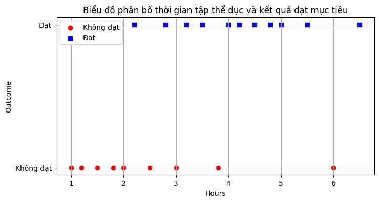
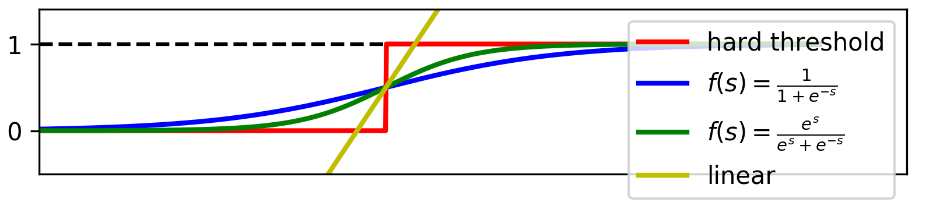

# I. Introduction
## 1. Hai mô hình tuyến tính
- *Hai mô hình tuyến tính là Linear Regression và Perceptron Learning Algorithm (PLA) đều có chung 1 dạng*:
  $$y = f(w^Tx)$$
  trong đó $f$ - **activation function** (hàm kích hoạt) và $x$ - dữ liệu mở rộng với cột $x_0 = 1$ được thêm vào (bias).
- Với linear regression, $f(s) = s$, còn với PLA $f(s) = \text{sgn}(s)$.
	- Linear regression:
		- Giá trị của tích vô hướng trên được sử dụng trực tiếp để dự đoán đầu ra $y$;
		- Phù hợp cho giá trị đầu ra thực không bị chặn trên/dưới.
	- PLA:
		- Giá trị chỉ nhận $1$ hoặc $-1$;
		- Phù hợp cho bài toán phân loại nhị phân.

- **Logistic Regression**: một dạng hàm activation, dùng cho các bài toán linh hoạt hơn $\to$ *đầu ra thể hiện ở dạng xác suất*.
	- Giống với Linear regression ở dạng đầu ra là số thực.
	- Giống với PLA do giá trị đầu ra bị giới hạn, ở đây là đoạn $[0,1]$.
- Thường được sử dụng nhiều hơn cho các bài toán classification.

- Xét bài toán với các điểm dữ liệu sau:
	
    

	- PLA không thể áp dụng cho bài toán này vì không thể nói một người học bao nhiêu giờ là sẽ đỗ. Nói các khác, dữ liệu này *không linearly separable*.
	- Và cũng có thể thấy cả Linear regression cũng không phù hợp với bài này.

## 2. Logistic Regression
- Đầu ra của hai mô hình tuyến trình trên là:
	- Linear Regression: Dự đoán giá trị liên tục bằng cách mô hình hóa mối quan hệ tuyến tính.
    $$f(x) = w^Tx$$
	- PLA: Thuật toán phân loại nhị phân dựa trên dấu qua hàm $\text{sgn}$
	$$f(x) = \text{sgn}(w^Tx)$$
- Trong khi đó nhiều bài toán thực tế yêu cầu dự đoán xác suất thuộc về một lớp cụ thể, thay vì chỉ đưa ra một giá trị liên tục hoặc một nhãn cứng, **đầu ra của Logistic Regression** được viết dưới dạng:
  $$f(x) = \theta(w^Tx)$$
  trong đó, $\theta$ : *logistic function* (hàm logistic).

- Dù có tên là Hồi quy nhưng Logistic Regression thường được sử dụng cho bài toán Classification, có dạng tương tự các mô hình tuyến tính $P(Y=1 \vert X; w) = f(w^T x)$.

- Một số **activation** cho mô hình tuyến tính:
  
	- **Đường vàng**: Linear Regression
		- Không phù hợp với bài toán do giá trị không bị giới hạn, nhưng ta có thể đưa về đoạn $[0,1]$ bằng cách cho các kết quả lớn hơn 1 về 1 và tương tự cho 0.
		- Ta xác định 1 ngưỡng cứng tại giao điểm với đường tung độ $y=0.5$ để phân chia dữ liệu.
		- Tuy nhiên thì nhiều dữ liệu sẽ bị đánh giá sai do không thể có đường thẳng để phân chia dữ liệu (ví dụ trên).
	- **Đường màu đỏ** - (khác với PLA ở chỗ giá trị là $0, 1$ thay vì $-1, 1$) rõ ràng không phù hợp vì giá trị không phân chia tuyến tính.
	- **Đường xanh lam/lục**: phù hợp cho bài toán vì có các tính chất:
		- Giá trị giới hạn trong $(0, 1)$.
		- Điểm tung độ $0.5$ là điểm phân chia: các giá trị càng xa về bên phải sẽ càng gần 1 và ngược lại, các giá trị bên trái sẽ càng gần 0.
			$\to$ Phù hợp với nhận xét rằng tập càng nhiều thì xác suất đạt càng cao.
		- Thuận lợi cho việc tối ưu, có đạo hàm ở mọi điểm (Smooth).

## 3. Sigmoid function (Logistic function)
- Trong các hàm số mang 3 tính chất trên, hàm **sigmoid**:
  $$f(s) = \dfrac{1}{1+e^{-s}} \triangleq \sigma(s) \text{ or } \theta(s)$$
  được sử dụng nhiều nhất, vì nó bị chặn trong khoảng $(0,1)$ - **tính giới hạn**, cụ thể:
  $$\lim_{s\to -\infty}{\sigma(s)} = 0;\hspace{5pt} \lim_{s\to \infty}{\sigma(s)} = 1$$
- Đồng thời, hàm sigmoid còn có tính chất:
  $$\begin{align*} \sigma'(s) &= \dfrac{e^{-s}}{(1+e^{-s})^2} \\ &=  \dfrac{1}{1+e^{-s}}\dfrac{e^{-s}}{1+e^{-s}} \\[4pt] &= \sigma(s)\left( 1-\sigma{(s)} \right)\end{align*}$$
- Vì *tính chất có đạo hàm đơn giản, hàm sigmoid được sử dụng rộng rãi* - **tính liên tục và khả vi**.
- Hàm sigmoid còn có **tính đơn điệu tăng** - giá trị đầu ra tăng khi đầu vào tăng.

- Ngoài ra, người ta còn thường sử dụng hàm $\tanh$:
  $$\tanh{(s)} = \dfrac{e^{s}-e^{-s}}{e^s+e^{-s}} \in (-1,1)$$
  nhưng ta có thể dễ dàng đưa về khoảng $(0,1)$ và đặc biệt, $\tanh(s) = 2\sigma(2s)-1$.

# II. Hàm mất mát và tối ưu
## 1. Xây dựng hàm mất mát: nguyên lý MLE
- Với hai mô hình phù hợp cho bài toán trên, ta giả sử:
	- Xác suất một điểm thuộc class 1: $f(w^Tx)$.
	- Xác suất một điểm thuộc class 0: $1 - f(w^Tx)$.
- Khi đó, ta viết như sau:
  $$\begin{align*} P(y_i = 1 \mid x_i, w) &= f(w^Tx_i) \\ P(y_i = 0 \mid x_i, w) &= 1 - f(w^Tx_i) \end{align*}$$
- Mục đích lúc này là xác định ma trận $w$ sao cho:
	- $P$ càng gần giá trị 1 càng tốt với các điểm dữ liệu thuộc class 1;
	- $P$ càng gần 0 càng tốt với các điểm thuộc class 0.
- Đặt $z_i = f(w^Tx_i)$, khi đó ta viết lại:
  $$P(y_i \mid x_i, w) = z_i^{y_i}(1-z_i)^{1-y_i}$$
---
- Xét tập dữ liệu huấn luyện $X = [x_1, x_2, ..., x_N] \in \mathbb{R}^{d\times N}$ và nhãn $y = [y_1, y_2, ..., y_N]$.
- Khi đó, ta xác định **$w$** để biểu thức đạt GTLN:
  $$P(y \mid X; w)$$
  nói cách khác:
  $$w = \arg\max_{w}{P(y \mid X; w)}$$
- **Mục tiêu của việc huấn luyện mô hình Logistic Regression**: tìm vector trọng số $w$ sao cho  $\hat{y} = \sigma(w^T x)$ gần với nhãn thực tế $y$ nhất có thể trên tập dữ liệu huấn luyện.
- Phương pháp để đạt được yêu cầu là **Maximum Likelihood Estimation** (MLE); hàm sau $\arg \max$ gọi là *hàm likelihood*.
- Cụ thể, *MLE tìm cách cực đại hóa hàm Likelihood*. Giả sử rằng các điểm dữ liệu được sinh ra một các ngẫu nhiên độc lập với nhau, ta có:
  $$\begin{align*} L(w) = P(y \mid X,w) &= \prod_{i=1}^{N}{P(y_i \mid x_i, w)} \\ &= \prod_{i=1}^{N}{z_i^{y_i} (1-z_i)^{1-y_i} } \end{align*}$$
---
- Trực tiếp tối ưu hàm số trên (tích) theo $w$ không đơn giản. Khi giá trị $N$ lớn, tích của $N$ số giá trị nhỏ hơn 1 có thể dẫn đến sai số, vì tích là số quá nhỏ.
- Một phương pháp được sử dụng là lấy $\log$ (cơ số $e$) của *likelihood function* biến phép nhân thành phép cộng.
	- Vì logarit là hàm đơn điệu tăng, nên cực đại của $L(w)$ tương đương cực đại $\ln(L(w))$.
- Sau đó, lấy ngược dấu và xác định đó là **hàm mất mát**.
	- Bài toán MLE - cực đại hóa $\ln(L(w))$;
	- Tương đương với bài toán Cực tiểu hóa hàm mất mát (loss function);
	- Là âm của Log-likelihood trung bình (Negative Log-Likelihood - NLL), thường được gọi là **Hàm Cross-Entropy Loss**:
    $$\begin{align*} J(w) &= -\dfrac{1}{N}\log{P(y \mid X;w)} \\[4pt] &= -\dfrac{1}{N}\sum_{i=1}^{N}{\left[y_i\log{z_i} + (1-y_i)\log(1-z_i) \right]} \end{align*}$$
    trong đó:
    - $z_i = f(w^Tx_i) \triangleq \hat{y}$.
  	- Vế phải được gọi là biểu thức *Cross-entropy* - sử dụng để đo khoảng cách 2 phân phối (distributions)
		- Trong bài này, Ccross-entropy đo lường "khoảng cách" giữa phân phối xác suất thực tế (nhãn $y_i$) và phân phối xác suất dự đoán bởi mô hình ($\hat{y}_i$)
		- Khi $\hat{y}_i$ gần với $y_i$, giá trị $J(w)$ nhỏ, ngược lại giá trị $J(w)$ sẽ rất lớn, phạt nặng các dự đoán sai và chắc chắn.
	- Chú ý vì Logarit thập phân ít được sử dụng trong Machine Learning, vì vậy $\log$ là kí hiệu của logarit tự nhiên.

## 2. Tối ưu hàm mất mát: GD và Stochastic GD
### 2.1 Tối ưu 
- Để tìm $w$ cực tiểu hóa $J(w)$, sử dụng các thuật toán tối ưu dựa trên gradient: Gradient Descent (GD) và các biến thể.
- Ý tưởng chung là cập nhập giá trị $w$ lặp lại theo hướng ngược lại của Gradient:
  $$w := w - \eta\nabla J(w)$$
  trong đó $\eta$ là tốc độ học.
- Gradient của $J(w)$ đối với $w$ được tính như sau:
  $$\nabla J(w) = \dfrac{1}{N}\sum_{i=1}^{N}{(z_i - y_i)}x_i$$

### 2.2 Srochastic Gradient Descent
- Sử dụng phương pháp SGD, ta xác định hàm mất mát với một điểm dữ liệu là: $$J(w; x_i, y_i) = -(y_i\log z_i + (1-y_i)\log(1-z_i) )$$
- Khi đó, ta có đạo hàm:
  $$\begin{align*} \dfrac{\partial J(w; x_i, y_i)}{\partial w} &=  -\left( \dfrac{y_i}{z_i} - \dfrac{1-y_i}{1-z_i} \right) \dfrac{\partial z_i}{\partial w} \\[4pt] &= \dfrac{z_i-y_i}{z_i(1-z_i)} \dfrac{\partial z_i}{\partial w} \end{align*}$$

### 2.3 Hàm sigmoid
- Với $z = f(w^Tx)$, xét hàm $s = w^Tx$, ta có:
  $$\dfrac{\partial z_i}{\partial w} = \dfrac{\partial z_i}{\partial s} \dfrac{\partial s}{\partial w} = \dfrac{\partial z_i}{\partial s} x$$
- Trực quan nhất, ta tìm hàm số $z = f(w^Tx) = f(s)$ sao cho: 
  $$\dfrac{\partial z}{\partial s} = z(1-z)$$
  để có thể *rút gọn phần mẫu ở biểu thức đạo hàm* ở trên.
- Tiếp tục, ta có:
  $$\begin{align*} & &\dfrac{\partial z}{z(1-z)} &= \partial s \\[4pt] &\Leftrightarrow &\left( \dfrac{1}{z} + \dfrac{1}{1-z} \right)\partial z &= \partial s \\[4pt] &\Leftrightarrow & \log z - \log(1-z) &= s \\[4pt] &\Leftrightarrow &\log\dfrac{z}{1-z} &= s \\[4pt] &\Leftrightarrow &\dfrac{z}{1-z} &= e^s \\[4pt] &\Leftrightarrow &z &= e^s(1-z) \\[4pt] &\Leftrightarrow &z &= \dfrac{e^s}{e^s + 1} = \dfrac{1}{1-e^{-s}} = \sigma(s) \end{align*}$$
- Trên đây là cách mà hàm sigmoid được xây dựng.

### 2.4 Công thức cập nhập cho Logistic (Sigmoid) Regression
- Nhờ việc sử dụng hàm sigmoid, lúc này ta có đạo hàm: $$\dfrac{\partial J(w; x_i, y_i)}{\partial w} = (z_i-y_i)x_i$$do đó, ta có công thức cập nhập (theo SGD) chính là:
  $$w = w + \eta (z_i-y_i)x_i$$
- Một số công thức cập nhập khác:
	- **Gradient Descent (Batch GD)**: sử dụng toàn bộ tập huấn luyện để tính gradient trong mỗi bước cập nhật
      $$w := w - \eta\dfrac{1}{N}\sum_{i=1}^{N}{(\sigma(w^T x_i) - y_i)x_i}$$
	- **Mini-batch GD**: thỏa hiệp giữa GD và SGD, sử dụng một batch nhỏ dữ liệu để tính gradient.

## 3. Regularization (L1, L2, Elastic Net)
- Hồi quy logistic có thể bị overfitting, đặc biệt khi số lượng đặc trưng lớn so với số lượng mẫu.
- **Regularization**: kỹ thuật *thêm một thành phần phạt vào hàm mất mát* để kiểm soát độ phức tạp của mô hình, giúp cải thiện khả năng tổng quát hóa trên dữ liệu mới.
- Hàm mất mát mới:
  $$J_{\text{reg}}(w) = J(w) + \lambda \times R(w)$$
  trong đó $R(w)$ là thành phần phạt - Regularization.
- **L2 Regularization (Ridge)**:
	- Phạt tổng bình phương các số;
	- $R(w) = \Vert w \Vert^2_2 = \sum{w_j^2}$
	- L2 có xu hướng làm giảm giá trị các trọng số nhưng không đưa về 0 hoàn toàn.
- **L1 Regularization (Lasso)**:
	- Phạt tổng giá trị tuyệt đối các trọng số;
	- $R(w) = \Vert w \Vert_1 = \sum{|w_j|}$
	- L1 có khả năng đưa một số trọng số về 0, thực hiện việc lựa chọn đặc trưng (feature selection).
- **Elastic Net:** Kết hợp cả L1 và L2.  
    - $J_{\text{ElasticNet}}(w) = J(w) + \lambda_1 \times L1 + \lambda_2 \times L2$.
- Tham số $\lambda$ (lambda) kiểm soát mức độ regularization. Giá trị $\lambda$ tối ưu thường được chọn thông qua cross-validation.

# III. Minh họa
```python
import numpy as np
import matplotlib.pyplot as plt

# Data
X_data = np.array([[0.50, 0.75, 1.00, 1.25, 1.50, 1.75, 1.75, 2.00, 2.25, 2.50, 2.75, 3.00, 3.25, 3.50, 4.00, 4.25, 4.50, 4.75, 5.00, 5.50]])
y_data = np.array([0, 0, 0, 0, 0, 0, 1, 0, 1, 0, 1, 0, 1, 0, 1, 1, 1, 1, 1, 1])

# Add bias (x0 = 1)
X_bar = np.concatenate((np.ones((1, X_data.shape[1])), X_data), axis=0)

def sigmoid(s):
    return 1 / (1 + np.exp(-s))

def logistic_regression(X, y, w_init, eta, tol=1e-4, max_iter=10000):
    w = [w_init]
    iter = 0
    N = X.shape[1]
    d = X.shape[0]
    check_w_after = 20

    while iter < max_iter:
        mix_id = np.random.permutation(N)
        for i in mix_id:
            xi = X[:, i].reshape(d, 1)
            yi = y[i]

            # Prediction
            zi = sigmoid(np.dot(w[-1].T, xi))
            # Update weight
            w_new = w[-1] + eta * (yi - zi) * xi
            iter += 1

            # Stopping Criteria
            if iter % check_w_after == 0:
                if np.linalg.norm(w_new - w[-1]) < tol:
                    print(f'Converged after {iter} iterations.')
                    return w
                w.append(w_new)
            else:
                w[-1] = w_new

            if iter >= max_iter:
                break

    print(f'Reached max iterations ({max_iter}).')
    return w

# Initialization
d = X_bar.shape[0]
w_init = np.random.randn(d, 1)
eta = 0.05

# Training
w_log = logistic_regression(X_bar, y_data, w_init, eta)
w_final = w_log[-1]
print("Weights (w0, w1):", w_final.T)

# Visualization
X0 = X_data[0, np.where(y_data == 0)][0]
y0 = y_data[np.where(y_data == 0)]
X1 = X_data[0, np.where(y_data == 1)][0]
y1 = y_data[np.where(y_data == 1)]

plt.plot(X0, y0, 'ro', markersize=8, label='Fail (0)')
plt.plot(X1, y1, 'bs', markersize=8, label='Pass (1)')

xx = np.linspace(0, 6, 1000)
w0 = w_final[0][0]
w1 = w_final[1][0]
yy = sigmoid(w0 + w1 * xx)

plt.plot(xx, yy, 'g-', linewidth=2, label='Learned Sigmoid Curve')

# Threshold
threshold = -w0 / w1
if 0 <= threshold <= 6:
    plt.plot(threshold, 0.5, 'y^', markersize=10, label='0.5 Threshold')

plt.xlabel('Study Hours')
plt.ylabel('Predicted Pass Probability')
plt.title('Logistic Regression: Study Hours vs. Pass Probability')
plt.legend()
plt.grid(True)
plt.show()

print(f"Decision threshold (hours for P=0.5): {threshold:.2f}")
```

# Minh học
[1] [Machine Learning Cơ bản](https://machinelearningcoban.com/2017/01/27/logisticregression/)

[2] https://www.ibm.com/think/topics/logistic-regression

[3] [Viblo](https://viblo.asia/p/logistic-regression-bai-toan-co-ban-trong-machine-learning-924lJ4rzKPM)

[4] [SpiceWorks](https://www.spiceworks.com/tech/artificial-intelligence/articles/what-is-logistic-regression/#:~:text=Logistic%20regression%20is%20a%20supervised%20machine%20learning%20algorithm%20that%20accomplishes,1%2C%20or%20true%2Ffalse.)