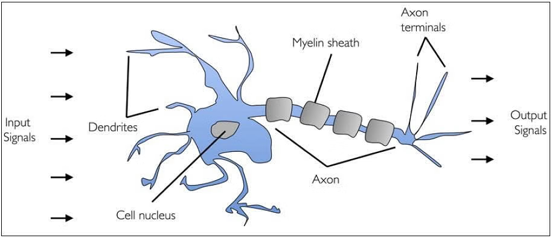
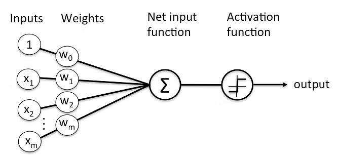
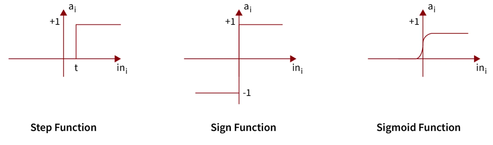
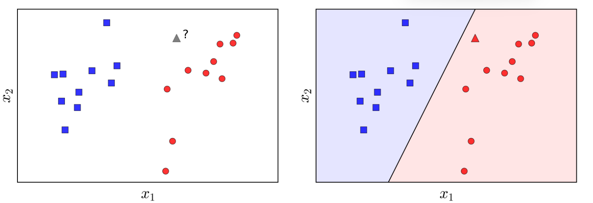
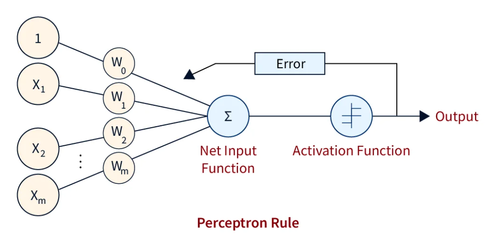

# I. Introduction
- Perceptron là khái niệm nền tảng và quan trọng trong lĩnh vực Trí tuệ Nhân tạo (AI) và Học máy (Machine Learning - ML).
	- Là *dạng đơn giản nhất của một Mạng Nơ-ron* Nhân tạo (Artificial Neural Network - ANN);
	- Đóng vai trò là một *đơn vị tính toán cơ bản*, một "nơ-ron nhân tạo".
- Mô hình này lấy cảm hứng từ cách hoạt động của các tế bào thần kinh sinh học (nơ-ron) trong não bộ, đặc biệt là dựa trên công trình trước đó của Warren McCulloch và Walter Pitts (nơ-ron MCP, 1943), những người đã mô tả tế bào thần kinh như một cổng logic đơn giản với đầu ra nhị phân.

- **Perceptron** là thuật toán học có giám sát tuyến tính, được thiết kể chủ yếu cho bài toán phân loại nhị phân.
- Dù đơn giản, nó đặt nền móng cho sự phát triển các mạng Neuron phức tạp và Deep Learning - đóng vai trò chính là khối xây dựng cơ bản, là nền tảng để hiểu các mô hình sau này.

# II. The Perceptron Model
## 1. Cảm hứng từ bộ não sinh học

- Mô phỏng một cách đơn giản chức năng của một Neuron não bộ.
	- Nơ-ron nhận tín hiệu đầu vào từ các nơ-ron khác thông qua các sợi nhánh (dendrites);
	- Xử lý thông tin tại thân tế bào (cell nucleus/soma);
	- Nếu tín hiệu tích lũy vượt qua một ngưỡng nhất định, một tín hiệu điện đầu ra truyền đi qua sợi trục (axon) đến các nơ-ron khác thông qua các khớp thần kinh (synapses).
- **Perceptron mô phỏng**:
	- Dendrites: các đầu vào (Inputs) của Perceptron;
	- Synapses: các trọng số (Weights) gán cho mỗi đầu vào, tầm quan trọng của kết nối đó;
	- Cell Nucleus/Soma: đơn vị xử lý trung tâm (Node), nơi tính toán tổng trọng số của các đầu vào.
	- Axon: đầu ra (Output) của Perceptron.
## 2. Artificial Neuron
- Là một hàm toán học dựa trên mô hình của mạng Neuron sinh học, tại đây mỗi Neuron sẽ nhận đầu vào, cân nhắc qua các trọng số, tổng hợp lại và sử dụng một hàm phi tuyến để đưa ra đầu ra.

## 3. Các thành phần
- Một Perceptron cơ bản (đặc biệt là Single-Layer Perceptron) bao gồm các thành phần chính:

- **Đầu vào (Inputs / Input Nodes)**:
	- Một hoặc nhiều giá trị đầu vào, ký hiệu là vector $x = [x_1, x_2, \dots, x_n]$;
	- Trong mô hình gốc của Rosenblatt, các đầu vào này là nhị phân (0 hoặc 1).
- **Trọng số (Weights)**:
	- Mỗi đầu vào $x_i$ được liên kết với một trọng số $w_i$ - tầm quan trọng của đầu vào đó đối với quyết định cuối cùng;
	- Vector trọng số là $w = [w_1, w_2, \dots, w_n]$.
- **Độ chệch (Bias)**:
	- Tham số bổ sung, kí hiệu $b$ hoặc $w_0$;
	- Hoạt động như một ngưỡng có thể điều chỉnh, giúp mô hình linh hoạt hơn trong phân loại;
	- Cách xử lí đơn giản là thêm đầu vào giả $x_0 = 1$ và liên kết nó với độ chệch;
	- Khi đó vector mở rộng bao gồm:
		- $\hat{x} = [1, x_1, x_2, \dots, x_n]$;
		- $w = [b, w_1, w_2, \dots, w_n]$.
- **Tổng trọng số (Weighted Sum)**: tích vô hướng (dot product) của vector trọng số và vector đầu vào (mở rộng):
  $$z = W^T\hat{x}$$
- **Hàm kích hoạt (Activation function)**:
	- Hàm phi tuyến (tuyến tính từng đoạn) được áp dụng lên tổng trọng số $z$ để tạo ra đầu ra $a$ cuối cùng.
    
    

	- Với Perceptron gốc, hàm kích hoạt thường là:
		- Hàm bước (Step Function): $\begin{cases} f(z) = 1 &, z \ge 0 \\[4pt] f(z) = 0 &, z < 0\end{cases}$
		
		- Hàm dấu (Sign Function): $\begin{cases} f(z) = 1 &, z \ge 0 \\[4pt] f(z) = 0 &, z < 0\end{cases}$
- **Đầu ra (Output)**: Giá trị đầu ra thường là giá trị nhị phân (0/1 hoặc 1/-1) đại diện cho lớp dự đoán từ mẫu đầu vào.

# III. PLA - Perceptron Learning Algorithm
- Thuật toán học Perceptron: là một *quy trình lặp đi lặp lại* nhằm mục đích *tìm ra một bộ trọng số* phù hợp để phân loại chính xác các điểm dữ liệu trong một bài toán phân loại nhị phân.

## 1. Mục tiêu (Goal)
- **Tự động học** được vector trọng số $w$ (bao gồm cả bias $w_0$) sao cho siêu phẳng quyết định $w^T \times x = 0$ có thể phân tách chính xác hai lớp dữ liệu trong tập huấn luyện.
- Vector trọng số đó xác định một siêu phẳng quyết định (decision hyperplane) trong không gian đặc trưng $w^Tx = 0$.
	- Mục tiêu là xác định $w$ để siêu phẳng phân tách hoàn hảo hai lớp:
		- Các điểm thuộc lớp $+1$ thì nằm về phía dương ($w^Tx > 0$);
		- Các điểm thuộc lớp $-1$ (hoặc $0$) thì nằm về phía âm ($w^Tx < 0$);

## 2. Điều kiện tiên quyết (Prerequisite): Linear Separability
- Chỉ được đảm bảo hội tụ nếu tập dữ liệu huấn luyện là khả phân tuyến tính (linearly separable).
	- Có nghĩa là tồn tại ít nhất một siêu phẳng có thể phân chia hoàn toàn các điểm dữ liệu của hai lớp.
	- Nếu dữ liệu không khả phân tuyến tính, thuật toán có thể sẽ lặp vô hạn hoặc dao động.

## 3. Algorithm

- **Bước 1 - Khởi tạo (Initialization)**:
	- Khởi tạo vector trọng số $w$ (bao gồm cả bias $w_0$);
	- Các giá trị khởi tạo rất nhỏ hoặc đơn giản là bằng vector $0$.
- **Bước 2 - Lặp (Iteration)**:
	- Việc này có thể được thực hiện bằng cách:
	    - Duyệt qua toàn bộ tập dữ liệu nhiều lần (gọi là các epochs);
	    - Trong mỗi epoch, các điểm dữ liệu thường được xem xét theo một thứ tự ngẫu nhiên.
	- Với mỗi điểm dữ liệu $(x, y_\text{true})$:
		- **Bước 2a**: Prediction - Tính toán đầu ra dự đoán $y_\text{pred}$ bằng cách sử dụng bộ trọng số hiện tại $w$:  
			- Tính tổng trọng số (pre activation): $z = w^T \times x$;
			- Sử dụng hàm kích hoạt (Sign) để đưa ra dự đoán: $y_\text{pred} = \text{activation}(z)$.
		- **Bước 2b**: Check & Update - So sánh $y_\text{pred}$ với $y_\text{true}$.
			- Nếu $y_\text{pred} = y_\text{true}$ (phân loại đúng): chuyển sang điểm dữ liệu tiếp theo.
			- Nếu $y_\text{pred} \neq y_\text{true}$ (phân loại sai): cập nhật vector trọng số $w$ theo *quy tắc cập nhật*.
- **Bước 3: Điều kiện dừng (Stopping Condition)**:
	- Lặp lại Bước 2 cho đến khi không còn điểm dữ liệu nào bị phân loại sai hoặc đạt đến số vòng lặp tối đa định trước.
### 3.1 Quy tắc cập nhật Trọng số (Weight Update Rule)
- Đây là cơ chế học tập cốt lõi của PLA.
- Khi một điểm $x$ bị phân loại sai, điều chỉnh $w$ để "đẩy" siêu phẳng quyết định theo hướng có khả năng phân loại đúng.

- Khi một điểm $x$ bị phân loại sai, trọng số $w$ được điều chỉnh;
- Quy tắc cập nhật phổ biến nhất (với ví dụ khi $y_\text{true} \in \{+1, -1\}$ và learning rate $\eta = 1$) là:
  $$w_\text{new} = w_\text{old} + y_\text{true} \times x$$
- **Giải thích**:
	- Nếu một điểm $y_\text{true} = +1 \textcolor{red}{\to} y_\text{pred} = -1$:
		- Quy tắc cập nhật là $w_\text{new} = w_\text{old} + (+1) \times x$;
		- Ý nghĩa:
			- Vector trọng số $w$ được "kéo" lại gần vector $x$ hơn (cùng hướng hơn);
			- Tăng giá trị tích vô hướng $w^Tx$, giúp nó có khả năng vượt ngưỡng 0 và được phân loại đúng là $+1$.
		- Việc cộng $x$ vào $w$ có xu hướng làm tăng $w^T \times x$, giúp đưa dự đoán về phía $+1$.
	- Nếu một điểm $y_\text{true} = -1 \textcolor{red}{\to} y_\text{pred} = +1$:
		- Quy tắc cập nhật là $w_\text{new} = w_\text{old} + (-1) \times x$;
		- Ý nghĩa:
			- Vector trọng số $w$ được "đẩy" ra xa vector $x$ hơn (khác hướng hơn);
			- Giảm giá trị tích vô hướng $w^Tx$, giúp nó có khả năng dưới ngưỡng 0 và được phân loại đúng là $-1$.
		- Việc cộng $x$ vào $w$ có xu hướng làm giảm $w^T \times x$, giúp đưa dự đoán về phía $-1$.
	
- Tổng quát hơn và có thể áp dụng cho đầu ra $0/1$ là:
  $$w_\text{new} = w_\text{old} + \eta (y_\text{true} - y_\text{pred})x$$
  về cơ bản giống như cách thực hiện ở ví dụ đơn giản trên, chỉ khác $y_\text{true} = +1 \textcolor{red}{\to} y_\text{pred} = -1$ thì công thức cập nhập là $w_\text{old}+2\eta x$ có hơn lớn về giá trị cập nhập thôi.

### 3.2 Giải thích quy tắc cập nhật dựa trên Hình học
- Tích vô hướng $w^T x$ liên quan đến $\text{cosin}$ của góc $\alpha$ giữa hai vector $w$ và $x$:
  $$w^T \times x = ||w|| \times ||x|| \times \cos(α)$$
- **Mục tiêu về mặt hình học** với các điểm:
	- Điểm dương ($y_\text{true} = +1$): $w^T x > 0 \to \cos(\alpha) > 0 \to \alpha < 90$ ($w$ và $x$ cùng hướng tương đối)
	- Điểm âm ($y_\text{true} = -1$)      : $w^T x < 0 \to \cos(\alpha) < 0 \to \alpha > 90$ ($w$ và $x$ khác hướng tương đối)

- Khi cập nhật $w$ bằng cách cộng hoặc trừ $x$:
	- **Trường hợp 1 (Điểm + bị phân loại -)**:
		- Công thức cập nhập: $w_\text{new} = w + x$;
		- Tích vô hướng mới: $w_\text{new}^T x = (w + x)^T x = w^T x + x^T x = w^T x + ||x||^2$;
		- Vì $w^T x$ ban đầu âm và $||x||^2$ dương, nên $w_\text{new}^T x > w^T x$, đang dịch chuyển về phía dương (góc $\alpha$ giảm).
	- **Trường hợp 2 (Điểm - bị phân loại +)**:
		- Công thức cập nhập: $w_\text{new} = w - x$;
		- Tích vô hướng mới: $w_\text{new}^T x = (w - x)^T x = w^T x - x^T x = w^T x - ||x||^2$;
		- Vì $w^T x$ ban đầu dương và $||x||^2$ dương, nên $w_\text{new}^T x < w^T x$, đang dịch chuyển về phía âm (góc $\alpha$ tăng).
- Như vậy, mỗi lần cập nhật, $w$ được điều chỉnh theo hướng làm giảm lỗi phân loại cho điểm dữ liệu cụ thể đó.
### 3.3 Sự hội tụ (Convergence)
- Định lý hội tụ Perceptron (Perceptron Convergence Theorem) chứng minh rằng nếu tập dữ liệu huấn luyện là khả phân tuyến tính (Linear Separable), thì thuật toán PLA sẽ hội tụ sau một số hữu hạn các bước cập nhật, tức là nó sẽ tìm ra một vector trọng số $w$ phân loại đúng tất cả các điểm huấn luyện.
# IV. Đánh giá
## 1. Các thành phần của Perceptron
- **Hàm kích hoạt (Activation Functions)**:
	- Perceptron gốc sử dụng hàm bước (Step) hoặc hàm dấu (Sign).
	- Các mạng nơ-ron hiện đại: Sigmoid, Tanh (Hyperbolic Tangent), ReLU (Rectified Linear Unit), Softmax để có thể *học các mối quan hệ phức tạp hơn và hỗ trợ lan truyền ngược* (backpropagation) hiệu quả,
	- Tuy nhiên, chúng không phải là một phần của thuật toán PLA cơ bản.
- **Thiên vị (Bias)**:
	- Việc xử lý bias như một trọng số $w_0$ cho đầu vào $x_0=1$ là một kỹ thuật chuẩn hóa giúp đơn giản hóa công thức toán học và cho phép siêu phẳng quyết định không nhất thiết phải đi qua gốc tọa độ.
- **Hàm mất mát (Loss Function)**:
	- PLA *không tối ưu hóa trực tiếp một hàm mất mát* liên tục bằng gradient descent theo cách thông thường, nó ngầm tối thiểu hóa số lượng điểm bị phân loại sai.
	- Một hàm mất mát có thể được định nghĩa cho các điểm bị phân loại sai $M$ là:
      $$J(w) = \sum_{x_i \in M}{(-y_iw^Tx_i)}$$
      Giá trị này luôn dương khi có lỗi và bằng $0$ khi không có lỗi.
	- Quy tắc cập nhật PLA có thể được xem như một dạng Stochastic Gradient Descent trên hàm mất mát này.

## 2. Các loại Perceptron
- **Single-Layer Perceptron (SLP)**:
	- Chỉ có một lớp trọng số kết nối trực tiếp từ đầu vào đến đầu ra;
	- Chỉ có thể học các hàm khả phân tuyến tính.
- **Multi-Layer Perceptron (MLP)**:
	- Có một hoặc nhiều lớp ẩn (hidden layers) giữa lớp đầu vào và lớp đầu ra.
	- Xếp chồng nhiều lớp nơ-ron và sử dụng các hàm kích hoạt phi tuyến, MLP có thể học các hàm phi tuyến phức tạp và giải quyết các bài toán không khả phân tuyến tính (như XOR).
	- Perceptron thường được dùng làm khối xây dựng cho MLP.

## 3. Điểm yếu của Perceptron
- Chỉ giải quyết bài toán khả phân tuyến tính: PLA sẽ không thể hội tụ nếu dữ liệu không thể tách biệt bằng một đường/mặt/ siêu phẳng
- Đầu ra nhị phân (mô hình gốc)
	- Chỉ tạo ra đầu ra nhị phân;
	- Khó áp dụng trực tiếp cho các bài toán hồi quy hoặc phân loại đa lớp.
- Không đảm bảo tìm ra siêu phẳng tối ưu:
	- Nếu có nhiều siêu phẳng có thể phân tách dữ liệu, PLA không đảm bảo tìm ra siêu phẳng nào là "tốt nhất";
	- Giải pháp tìm được phụ thuộc vào thứ tự duyệt dữ liệu và giá trị khởi tạo của trọng số.
- Nhạy cảm với tốc độ học và thứ tự dữ liệu
- **Thuật toán Pocket**:
	- Để đối phó với dữ liệu không khả phân tuyến tính hoặc có nhiễu, có một biến thể gọi là Thuật toán Pocket;
	- Thuật toán này chạy PLA trong một số vòng lặp cố định và "giữ trong túi" (pocket) vector trọng số $w$ nào đã phân loại đúng nhiều điểm nhất cho đến thời điểm đó.
	- Kết quả cuối cùng là vector trọng số tốt nhất đã tìm được.

# Tham khảo
- https://www.scaler.com/topics/machine-learning/perceptron-learning-algorithm/
- https://machinelearningcoban.com/2017/01/21/perceptron/